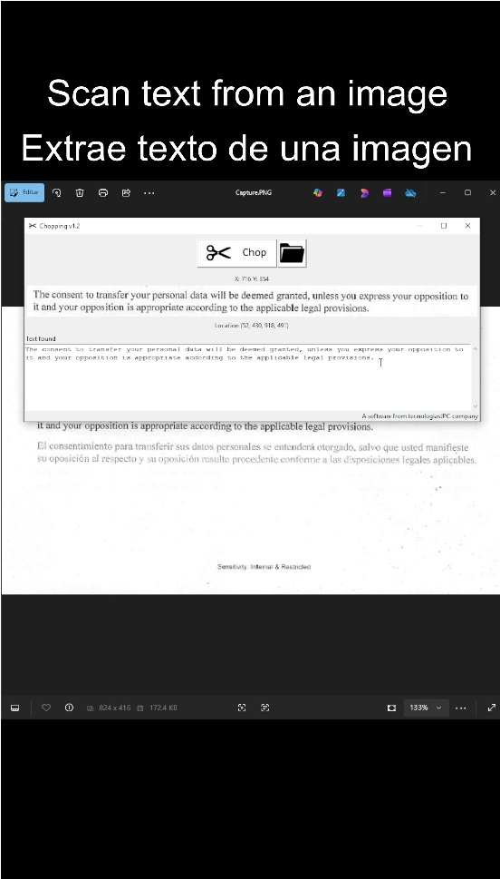

# Getting a web from a QR code
Use chop button to select an area in your screen. The image will be saved and analyzed to determine if it contains a QR code.

# Getting text from an image
In case only text is detected, it is going to be displayed in a textbox.

# Instructional video available on youtube

Software for free use.